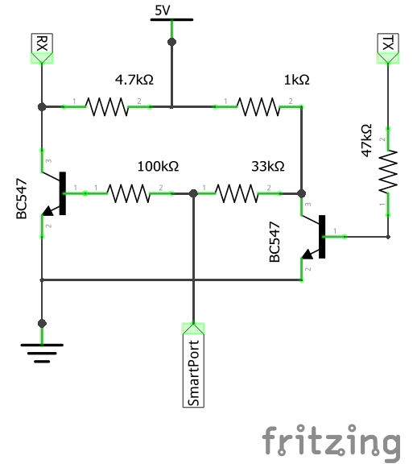
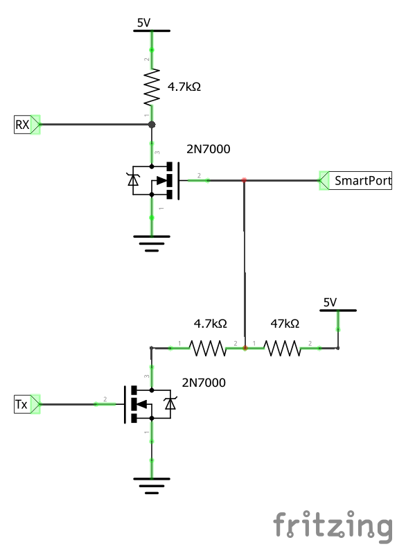

# Telemetry

Telemetry allows you to know what is happening on your aircraft while you are flying it.  Among other things you can receive battery voltages and GPS positions on your transmitter.

Telemetry can be either always on, or enabled when armed.  If a serial port for telemetry is shared with other functionality then then telemetry will only be enabled when armed on that port.

Telemetry is enabled using the 'TELEMETRY' feature.

```
feature TELEMETRY
```

Multiple telemetry providers are currently supported, FrSky, Graupner
HoTT V4, SmartPort (S.Port) and LightTelemetry (LTM)

All telemetry systems use serial ports, configure serial ports to use the telemetry system required.

## FrSky telemetry

FrSky telemetry is transmit only and just requires a single connection from the TX pin of a serial port to the RX pin on an FrSky telemetry receiver.

FrSky telemetry signals are inverted.  To connect a cleanflight capable board to an FrSKy receiver you have some options.

1. A hardware inverter - Built in to some flight controllers.
2. Use software serial and enable frsky_inversion.
3. Use a flight controller that has software configurable hardware inversion (e.g. STM32F30x).

For 1, just connect your inverter to a usart or software serial port.

For 2 and 3 use the CLI command as follows:

```
set telemetry_inversion = ON
```

### Precision setting for VFAS

INAV can send VFAS (FrSky Ampere Sensor Voltage) in two ways:

```
set frsky_vfas_precision  = 0
```
This is default setting which supports VFAS resolution of 0.2 volts and is supported on all FrSky hardware.

```
set frsky_vfas_precision  = 1
```
This is new setting which supports VFAS resolution of 0.1 volts and is supported by OpenTX and er9x/ersky9x firmware (this method uses custom ID 0x39).


### Notes

RPM shows throttle output when armed.
RPM shows when disarmed.
TEMP2 shows Satellite Signal Quality when GPS is enabled.

RPM requires that the 'blades' setting is set to 12 on your receiver/display - tested with Taranis/OpenTX.

## HoTT telemetry

Only Electric Air Modules and GPS Modules are emulated.

Use the latest Graupner firmware for your transmitter and receiver.

Older HoTT transmitters required the EAM and GPS modules to be enabled in the telemetry menu of the transmitter. (e.g. on MX-20)

Serial ports use two wires but HoTT uses a single wire so some electronics are required so that the signals don't get mixed up.  The TX and RX pins of
a serial port should be connected using a diode and a single wire to the `T` port on a HoTT receiver.

Connect as follows:

* HoTT TX/RX `T` -> Serial RX (connect directly)
* HoTT TX/RX `T` -> Diode `-(  |)-` > Serial TX (connect via diode)

The diode should be arranged to allow the data signals to flow the right way

```
-(  |)- == Diode, | indicates cathode marker.
```

1N4148 diodes have been tested and work with the GR-24.

As noticed by Skrebber the GR-12 (and probably GR-16/24, too) are based on a PIC 24FJ64GA-002, which has 5V tolerant digital pins.

Note: The SoftSerial ports may not be 5V tolerant on your board.  Verify if you require a 5v/3.3v level shifters.

## LightTelemetry (LTM)

LTM is a lightweight streaming telemetry protocol supported by a
number of OSDs, ground stations and antenna trackers.

The INAV implementation of LTM implements the following frames:

* G-FRAME: GPS information (lat, long, ground speed, altitude, sat
  info)
* A-FRAME: Attitude (pitch, roll, heading)
* S-FRAME: Status (voltage, current+, RSSI, airspeed+, status). Item
  suffixed '+' not implemented in INAV.
* O-FRAME: Origin (home position, lat, long, altitude, fix)

In addition, in the inav (navigation-rewrite) fork:
* N-FRAME: Navigation information (GPS mode, Nav mode, Nav action,
  Waypoint number, Nav Error, Nav Flags).

LTM is transmit only, and can work at any supported baud rate. It is
designed to operate over 2400 baud (9600 in INAV) and does not
benefit from higher rates. It is thus usable on soft serial.

More information about the fields, encoding and enumerations may be
found at
https://github.com/stronnag/mwptools/blob/master/docs/ltm-definition.txt

## MAVLink telemetry

MAVLink is a very lightweight, header-only message marshalling library for micro air vehicles.
Cleanflight supports MAVLink for compatibility with ground stations, OSDs and antenna trackers built
for PX4, PIXHAWK, APM and Parrot AR.Drone platforms.

MAVLink implementation in Cleanflight is transmit-only and usable on low baud rates and can be used over soft serial.

## SmartPort (S.Port)

Smartport is a telemetry system used by newer FrSky transmitters and receivers such as the Taranis/XJR and X8R, X6R and X4R(SB).

More information about the implementation can be found here: https://github.com/frank26080115/cleanflight/wiki/Using-Smart-Port

In time this documentation will be updated with further details.

Smartport devices can be connected directly to STM32F3 boards such as the SPRacingF3 and Sparky, with a single straight through cable without the need for any hardware modifications on the FC or the receiver.

For Smartport on F3 based boards, enable the telemetry inversion setting.

```
set telemetry_inversion = ON
```

### SmartPort (S.Port) with external hardware inverter

It is possible to use DIY UART inverter to connect SmartPort receivers to F1 and F4 based flight controllers. This method does not require hardware hack of S.Port receiver.

#### SmartPort inverter using bipolar transistors


#### SmartPort inverter using unipolar transistors


**Warning** Chosen UART has to be 5V tolerant. If not, use 3.3V power supply instead (not tested)

When external inverter is used, following configuration has to be applied:

```
set smartport_uart_unidir = ON
set telemetry_inversion = OFF
```

This has been tested with Flip32 F4 / Airbot F4 and FrSky X4R-SB receiver.
